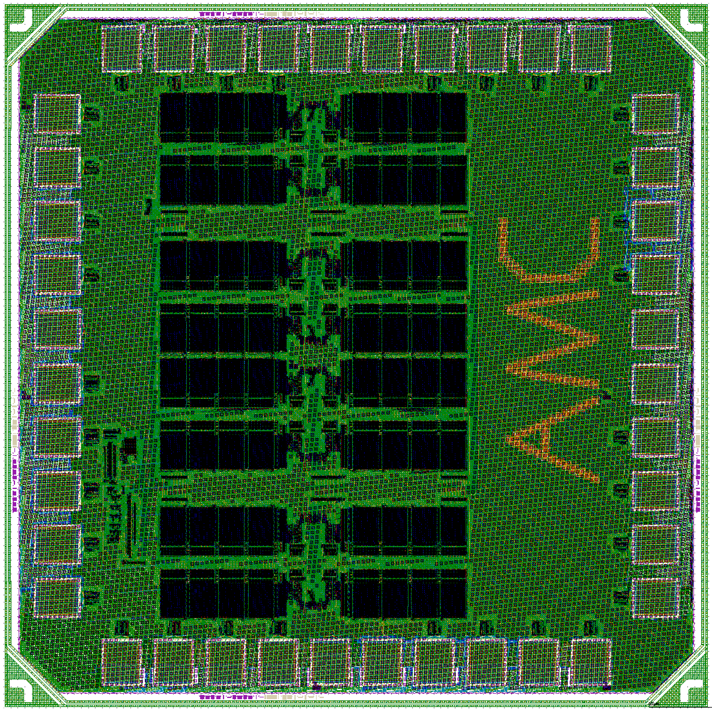

# AMC :  An Asynchronous Memory (SRAM) Compiler.

AMC is an open-source asynchronous pipelined memory compiler. 
AMC generates SRAM modules with a bundled-data datapath and 
quasi-delay-insensitive control. AMC is a Python-base, flexible, user-modifiable and 
technology-independent memory compiler that generates fabricable 
SRAM blocks in a broad range of sizes, configurations and process nodes.

The description of the circuits AMC generates and the compiler
can be found in the following paper:
   * Samira Ataei and Rajit Manohar. AMC: An Asynchronous Memory Compiler. Proceedings of the IEEE International Symposium on Asynchronous Circuits and Systems (ASYNC), May 2019.

AMC generates GDSII layout data, standard SPICE netlists, Verilog models, 
DRC/LVS verification reports, timing and power models (.lib), and placement and 
routing models (.lef). 

More detailed documentation is available here: http://avlsi.csl.yale.edu/act/doku.php?id=amc:start

# Copyright Notice

AMC is licensed under GNU General Public License v2.0. AMC project originated from the OpenRAM code version 7b5791b from May 9, 2018 (also contributed to by Samira Ataei) but has made a large number of changes to it since then that have to do with changing the memory interface circuits, supporting modern design rules and thin-cell SRAM layout, new partitioning and floorplanning, and different timing and characterization methodology. The organization of the code base mirrors the OpenRAM version 7b5791b. As OpenRAM is under BSD 3-Clause License, portions of code that are derived from OpenRAM remain under BSD license.
